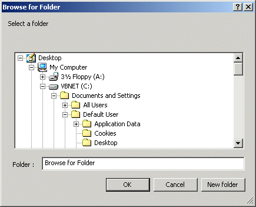



## Yet Another Better Browse for Folder

### Description

This module provides a Win2K interface to the Browse for Folder under Win95/98.

This is not an update to my earlier submissions but a complete rewrite using

pure API. With Win2K MS introduced a new DLL (SHELL32.DLL Version 5.0) which

includes a better Edit box, Popup menu and a New Folder button. With this module

you can achieve the same result (except the Popup menu) using the old DLL

(SHELL32.DLL Version 4.71) as used by Win 95/98. Additionally you can add a

checkbox, customise captions for Titlebar, OK button, Cancel button, New Folder

button. You can also resize the Browse for folder window. Additionally you can

choose to open the dialog double size or full screen. All the usual features are

present, such as include files, start at special folders etc. You can select

between the old style Editbox or the Win2K style editbox (Much better I think.)

Why bother? - Not everyone is running Win2K. Very easy to call. Heavily commented

and includes complete sample usage. Please vote if you find this useful.
 
### More Info
 

             |
---                |---
**Submitted On**   |2001-04-14 12:33:24
**By**             |[MrBobo](https://github.com/Planet-Source-Code/PSCIndex/blob/master/ByAuthor/mrbobo.md)
**Level**          |Advanced
**User Rating**    |4.9 (64 globes from 13 users)
**Compatibility**  |VB 6\.0
**Category**       |[Files/ File Controls/ Input/ Output](https://github.com/Planet-Source-Code/PSCIndex/blob/master/ByCategory/files-file-controls-input-output__1-3.md)
**World**          |[Visual Basic](https://github.com/Planet-Source-Code/PSCIndex/blob/master/ByWorld/visual-basic.md)
**Archive File**   |[Yet Anothe183384132001\.zip](https://github.com/Planet-Source-Code/mrbobo-yet-another-better-browse-for-folder__1-22387/archive/master.zip)

